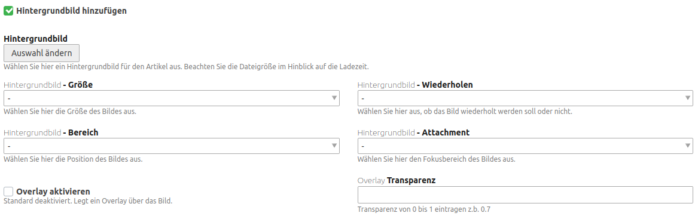

# Dreibein Article-Background Bundle 

Dieses Bundle erweitert die Artikel-Konfiguration um mehrere Felder um dem Artikel einen Hintergrund zuweisen zu können.



---

### Variablen:

Im Article-Template stehen dann folgende Variablen zur Verfügung:

| Name | Beschreibung |
| --- | --- |
| `dreibeinArticleBackground` | Hilft bei der Überprüfung, ob ein Hintergrundbild angezeigt werden soll. |
| `dreibeinArticleBackgroundStyle` | Beinhaltet den ausgewählten Style für das Hintergrundbild. |
| `dreibeinArticleOverlay` | Hilft bei der Überprüfung, ob ein Overlay verwendet werden soll. |
| `dreibeinArticleOverlayStyle` | Beinhaltet den Styl des Overlays. |

---

### Anwendung:

```html
<!-- Überprüfen, ob ein Hintergrundbild verwendet werden soll. Einfügen des generierten Styles. -->
<div class="<?= $this->class ?> block <?php if (!$this->dreibeinArticleBackground): ?>nobak<?php endif; ?>"<?= $this->cssID ?> style="<?= $this->dreibeinArticleBackgroundStyle ?>">

    <!-- Überprüfen, ob ein Overlay ausgegeben werden soll. -->
    <?php if ($this->dreibeinArticleOverlay): ?>
        <div class="mod_article_overlay" style="<?= $this->dreibeinArticleOverlayStyle ?>"></div>
    <?php endif; ?>

</div>
```
